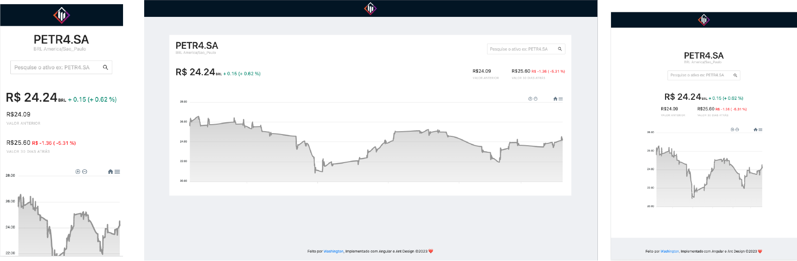

## Desafio AtivosApp

<p align="center">   </p>


<p align="center"> </p>

<h1 align="center" style="font-size:4em"></h1>

<p align="center">Esse é o desafio Peoples para frontEnd</p>

# Tecnologias envolvidas

- Angular
- TypeScript
- Ng-Zorro (Ant-Framework)
- ApexCharts
- Angular Proxy
- YahooFinance Api


# Features

- Consultar o preço do ativo na API do Yahoo Finance
- Implementar uma página em Angular que apresente o valor do ativo nos últimos 30 pregões e mostre a variação do preço no período. Você deverá considerar o valor de abertura (chart.result.indicators.quote.open)
- Inclua um gráfico apresentando o resultado da variação.

# Rodando o Projeto

```
# Clone esse repositorio
git@github.com:washingtonbsb/people-teste.git

# Entre no repositorio
cd people-teste

# Instale as dependencias
npm install

# Inicie o front com o comando abaixo, para poder rodar o script do proxy
npm run start


```


